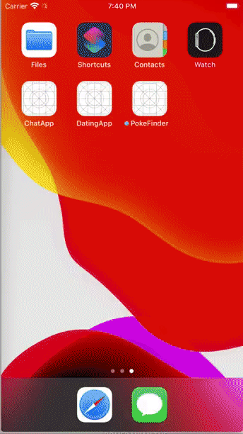
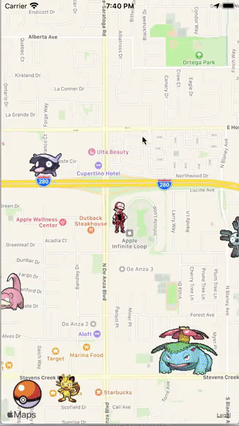
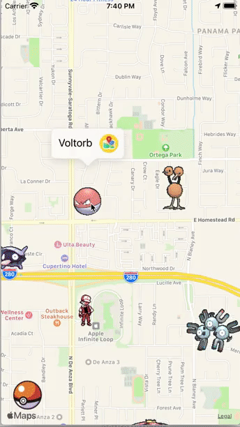

# Poke Finder
An iOS app in Swift 4 to discover the location of any Pokemon that has been found by other players 

## User and Pokemon location
You can see your location and the Pokemon has been found by you and other players

The location of the Pokemon is updated in real-time using Firebase Real-time Database and the GeoFire library to store and query Pokemon based on their geographic location

## Add Pokemon location
You can add the location of the Pokemon into the map by centering the map at the selected location and click the PokeBall to create new Pokemon's location

The Pokemon's location is updated in real-time using Firebase Real-time Database. 

## View the direction to the Pokemon's location
There is an annotation above the Pokemon that show the name of the Pokemon.
The map icon next to the Pokemon's name will show the direction from the user to the Pokemon

## Built With
* UIKit
* CoreLocation
* Firebase Real-time Database 
* GeoFire

